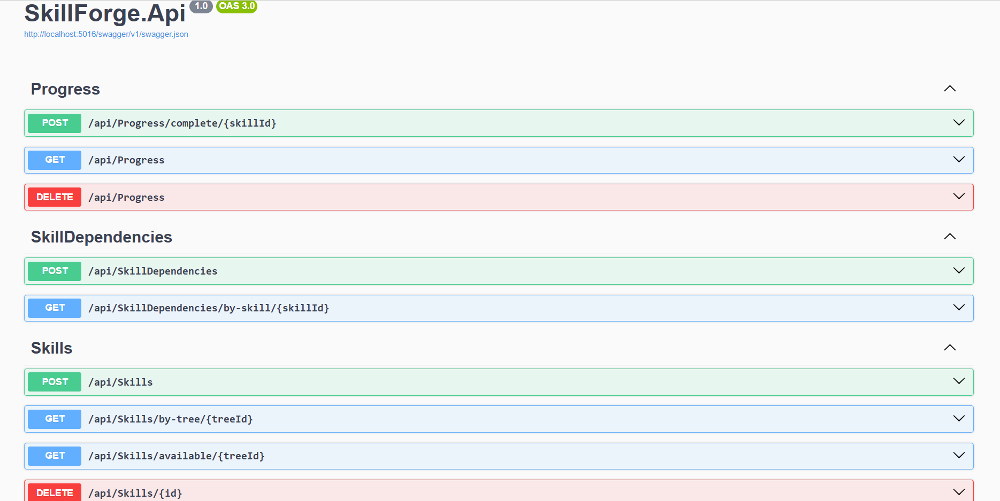

# 🌳 SkillForge API

SkillForge is a backend Web API built with **ASP.NET Core** that models **learning progression** using skill trees, dependencies, and user progress.

This project simulates how real platforms (like learning systems or games) unlock content dynamically based on rules — demonstrating **backend engineering beyond basic CRUD**.

---

## 🧠 Why this project matters

SkillForge was designed to show how backend systems:
- Enforce **prerequisite rules**
- Model **dependency graphs**
- Control access to resources based on logic
- Track user progress in structured systems

It reflects real-world patterns used in:
- Learning platforms  
- Certification systems  
- Gamified systems  
- Role progression systems  

---

## ⚙️ Tech Stack

- ASP.NET Core Web API  
- Entity Framework Core  
- SQL Server  
- C#  
- Swagger (OpenAPI)  

---

## 📸 API Preview (Swagger)




## ✨ Core Features

- Skill trees (e.g. ".NET Backend Roadmap")  
- Skills grouped under each tree  
- Skill prerequisites (dependency system)  
- User progress tracking  
- Dynamic skill unlocking based on completion  
- RESTful API endpoints  
- Swagger documentation for easy testing  

---

## 📌 Example Business Logic

C# Basics → OOP → ASP.NET Core


- If the user completes **C# Basics**, then **OOP** becomes available  
- If the user completes **OOP**, then **ASP.NET Core** becomes available  

This simulates real progression systems used in modern learning platforms.

---

## ▶️ How to Run the Project

1. Clone the repository:
   ```bash
   git clone https://github.com/walidmohmmedce-lgt/skillforge-api.git
   cd skillforge-api
2. Update your connection string in:
   appsettings.json
3. Run database migrations:
   dotnet ef database update
4. Run the project:
   dotnet run
5. Open Swagger:
   https://localhost:XXXX/swagger

🧪 Quick Test Guide (Swagger)

You can simulate the full logic using Swagger:
1. Create a skill tree
 POST /api/skilltrees
{ "name": ".NET Backend Roadmap" }
2. Add skills
POST /api/skills
{ "name": "C# Basics", "skillTreeId": 1 }
POST /api/skills
{ "name": "OOP", "skillTreeId": 1 }
3. Add dependency (OOP requires C# Basics)
POST /api/skilldependencies
{ "skillId": 2, "requiredSkillId": 1 }
4. Mark skill as completed
POST /api/progress/complete/1
5. Check available skills
GET /api/skills/available/1
You will observe that skills unlock dynamically based on completed prerequisites.

📄 Purpose of the Project

This project was built to:
Demonstrate backend business logic modeling
Practice dependency-based systems
Show readiness for real-world backend engineering
Serve as a strong portfolio project

👤 Author

Walid Mohmmed
.NET Backend Developer
GitHub: https://github.com/walidmohmmedce-lgt

LinkedIn: https://www.linkedin.com/in/walid-mohmmed-8333583a3
